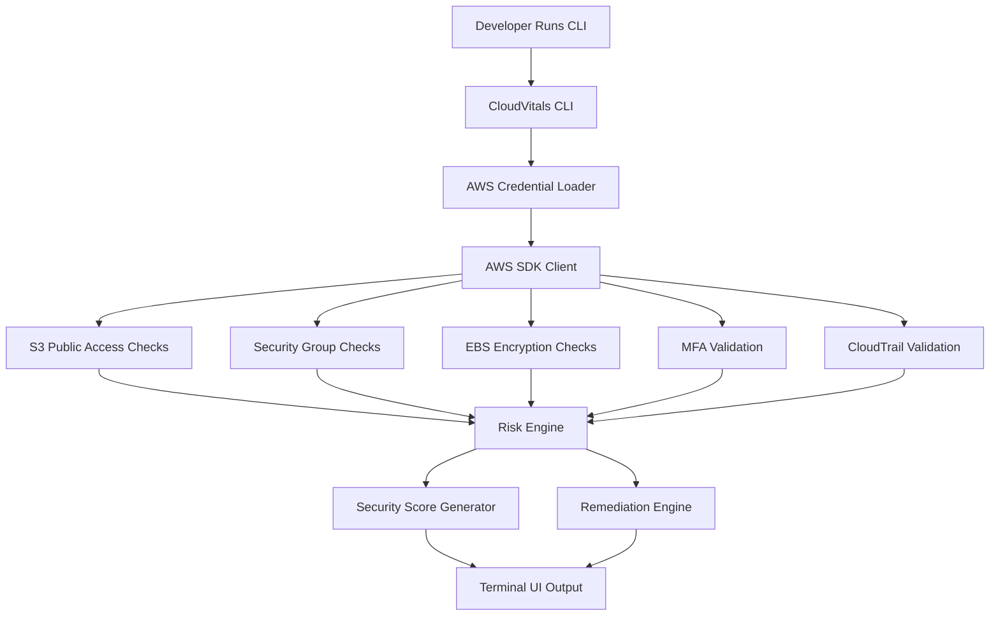

# CloudVitals Architecture

## Overview

CloudVitals is a developer-first cloud security scanner focused on identifying the highest-risk AWS misconfigurations with minimal noise.

The system is intentionally lightweight:
- Fast scans
- Opinionated checks
- CLI-native UX
- Actionable remediation guidance

---

# High-Level Architecture



---

# Core Components

## CLI Layer
Responsible for:
- command parsing
- scan orchestration
- output rendering
- configuration loading

Built with:
- Go
- Cobra
- Charm/Lipgloss

---

## AWS Integration Layer
Handles:
- AWS authentication
- SDK session creation
- account metadata retrieval

Built with:
- AWS SDK for Go v2

---

## Check Engine
Each security check:
- runs independently
- returns structured findings
- maps to a Zero Trust principle
- includes remediation guidance

Example finding structure:

```json
{
  "id": "s3_public",
  "severity": "CRITICAL",
  "resource": "backup-bucket",
  "risk": "Public data exposure",
  "fix_command": "aws s3api put-public-access-block ..."
}
```

---

# Security Philosophy

CloudVitals intentionally avoids:
- excessive compliance checks
- alert fatigue
- enterprise dashboard complexity

Instead, it focuses on:
- breach-critical misconfigurations
- developer usability
- rapid remediation

---

# Future Architecture Expansion

Planned future capabilities:
- GitHub Actions integration
- Multi-cloud support (GCP/Azure)
- Drift detection
- CI/CD policy enforcement
- JSON and SARIF exports
- Risk correlation engine

---

# Design Principles

- Fast by default
- Minimal dependencies
- Clear findings
- Human-readable remediation
- Zero Trust aligned
